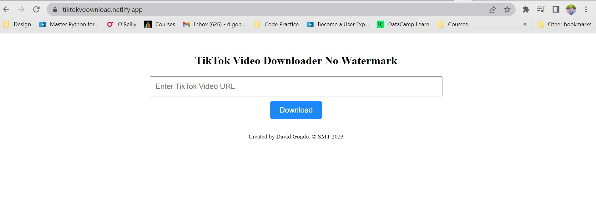

# TikTok Video Downloader

TikTok Video Downloader is a simple tool that allows you to download videos from TikTok. This repository contains the source code for the TikTok Video Downloader application.

## Table of Contents

- [Installation](#installation)
- [Usage](#usage)
- [Features](#features)
- [Contributing](#contributing)
- [License](#license)

## Installation

To use TikTok Video Downloader, follow these steps:

1. Clone the repository to your local machine using the following command:
   git clone https://github.com/Stoichiometrical/tiktok-video-downloader.git
2. Install the required dependencies by running the following command:
    npm install

3. Start the application using the following command:
     npm run dev
4.
4. Open your web browser and navigate to `http://localhost:3000` to access the TikTok Video Downloader.

## Usage

To download videos from TikTok using this application:

1. Open TikTok in your web browser.
2. Find the TikTok video you want to download.
3. Copy the URL of the TikTok video.
4. Paste the URL into the input field on the TikTok Video Downloader website.
5. Click the "Download" button.
6. The video will be downloaded to your local machine.

## Features

- Download videos from TikTok by providing the video URL.
- Simple and intuitive user interface.
- Cross-platform compatibility.

## Contributing

Contributions are welcome! If you would like to contribute to TikTok Video Downloader, please follow these steps:

1. Fork the repository.
2. Create a new branch for your feature or bug fix.
3. Make your changes and commit them.
4. Push your changes to your forked repository.
5. Submit a pull request to the main repository.

Please ensure that your code adheres to the existing code style and includes appropriate tests.
l have also deployed the  website at  [tikokvdownload.netlify.app]()

## License

This project is licensed under the [MIT License](LICENSE). Feel free to use and modify the code as per the license terms.

